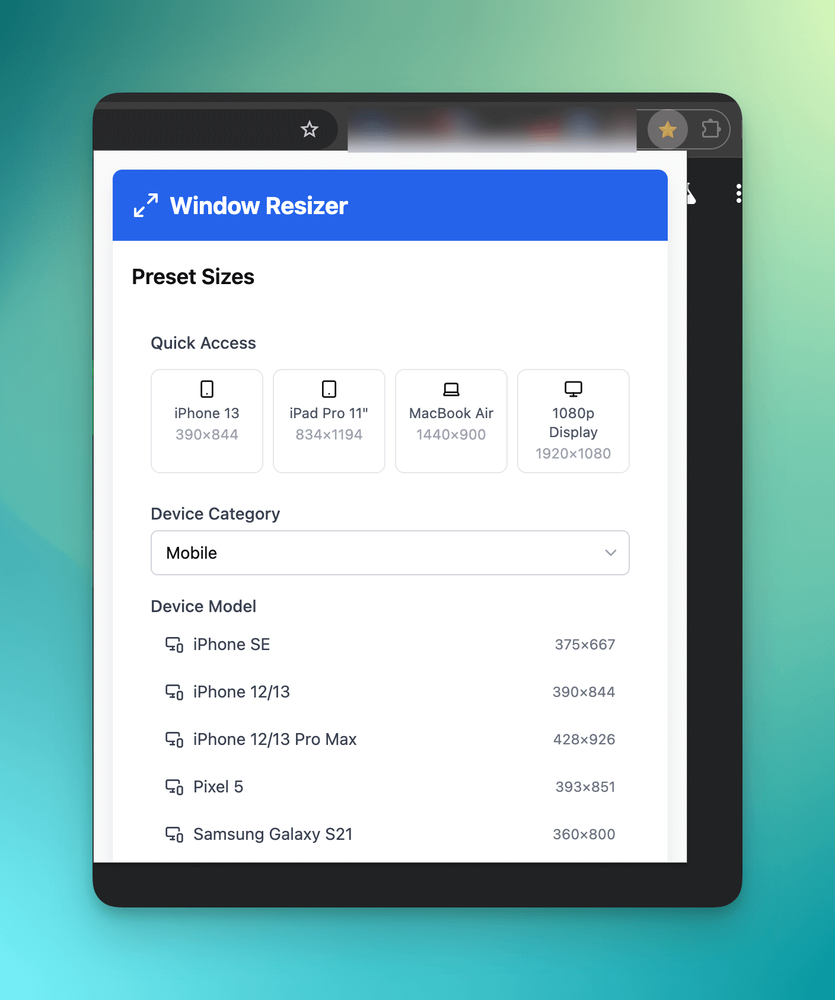

# 浏览器窗口尺寸调整工具

一个简单实用的浏览器窗口尺寸调整工具，帮助开发者快速将浏览器窗口调整至常用设备尺寸。

## 项目简介

这个工具主要用于在大屏幕显示器上进行前端开发时，快速将浏览器窗口调整到特定设备的尺寸，方便进行响应式设计和测试。

## 特点

- 一键调整浏览器窗口尺寸
- 支持常见设备尺寸预设
- 简洁直观的用户界面

## 致谢

本项目由 [Bolt.new](https://bolt.new) AI 辅助生成，经过简单样式调整优化。
